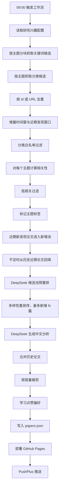

# Paper Daily 推荐算法详解

本文档描述 Paper Daily 当前实际运行的论文推荐算法。它面向两个问题：

1. 每天从 arXiv 等来源找到和研究兴趣相关的新论文。
2. 在有限推送数量内，优先展示高相关、近期、不过度重复、值得点开的论文。

当前线上工作流主要使用 arXiv，并开启分类扩展搜索；摘要模型使用 DeepSeek V4 Flash，即 `deepseek-v4-flash`。

## 1. 总览



核心原则：

- **召回要宽**：先用分块关键词和 arXiv 分类多抓一些候选，避免漏掉关键词靠后的论文。
- **排序要严**：候选进入后再使用完整关键词、分类、词汇重合、时效、偏好、跨主题信号打分。
- **推送要克制**：单次最多新增 30 篇，并用多样性重排序避免同一主题或相似标题刷屏。
- **历史要保留**：高/中相关论文、最近低相关论文和点赞论文会继续保留。
- **通知看首次发现**：PushPlus 的“今日新论文”按北京时间当天的 `first_seen_at` 统计，而不是 arXiv 的 `published` 日期。

## 2. 触发与运行时间

### 2.1 GitHub Actions

线上 workflow 位于 `.github/workflows/daily.yml`：

```yaml
schedule:
  - cron: '0 1 * * *'  # 09:00 Asia/Shanghai
```

GitHub cron 使用 UTC，所以 `1:00 UTC` 对应北京时间 `09:00`。

需要注意：GitHub Actions 的 `schedule` 不是强实时定时器。到点后 GitHub 会把任务放入队列，实际启动时间取决于 GitHub runner 调度。因此它能表达“计划 09:00 触发”，但不能保证精确到 09:00:00。

### 2.2 本地 macOS 触发器

项目还提供本地触发脚本：

```text
scripts/trigger_daily_workflow.sh
```

本机 `launchd` 每天 09:00 调用该脚本，脚本通过 `gh workflow run daily.yml` 触发 GitHub workflow。日志写入：

```text
logs/local-trigger.log
logs/local-trigger.err.log
```

本地触发更接近准点，但依赖 Mac 当时处于开机、未深度睡眠、网络可用、`gh` 登录有效的状态。

## 3. 配置输入

默认配置来自：

```text
config/interests.json
```

每个主题包含：

```json
{
  "id": "homotopy_theory",
  "name": "Homotopy Theory",
  "description": "...",
  "keywords": ["homotopy theory", "spectral sequence", "..."],
  "arxiv_categories": ["math.AT"]
}
```

全局配置还包括：

- `sources`：论文来源。
- `arxiv_categories_whitelist`：全局 arXiv 分类硬过滤。
- `negative_terms`：负向词和惩罚系数。

如果仓库 Issue 中存在标题为 `Research Interests` 的配置，代码会尝试读取其中 JSON 并覆盖默认主题配置。

## 4. 数据来源与候选召回

当前支持以下来源：

- arXiv
- OpenAlex
- Crossref
- Semantic Scholar，可选
- Google Scholar，需要 SerpApi
- RSS/Atom Feed

线上 workflow 主要启用 arXiv。

### 4.1 关键词搜索

对每个主题，arXiv 查询默认使用关键词模式：

```text
(all:"keyword1" OR all:"keyword2" OR ...)
```

为了控制 arXiv API 请求长度，关键词会按块拆成多次查询。默认每块 8 个关键词；线上默认抓 2 块，因此每个主题最多用前 16 个关键词做关键词召回。

这只是第一层召回，不是最终评分。进入候选后，评分阶段会使用主题的完整关键词列表。

相关参数：

```text
ARXIV_KEYWORD_CHUNK_SIZE = 8
ARXIV_KEYWORD_QUERY_CHUNKS = 2  # 线上默认
```

### 4.2 分类扩展搜索

线上开启：

```yaml
ARXIV_EXPAND_CATEGORY_SEARCH: 'true'
ARXIV_CATEGORY_MAX_RESULTS: '75'
```

因此每个主题除了关键词查询，还会额外抓取主题 arXiv 分类中的近期论文。例如同伦理论会抓取：

```text
cat:math.AT
```

这样可以避免漏掉 `topological Hochschild homology`、`THH`、`spectral sequence` 等位于关键词列表后部、但分类高度相关的论文。

### 4.3 排序方式

arXiv 查询默认使用：

```text
sortBy=submittedDate
sortOrder=descending
```

即优先拿最近提交或更新的条目。

### 4.4 如何接入 arXiv API

项目通过 arXiv 官方 Atom API 接入论文数据，不需要 API Key。

基础地址：

```text
https://export.arxiv.org/api/query
```

代码入口：

```text
fetch_arxiv(topic, max_results)
  -> fetch_arxiv_query(search_query, max_results, sort_by, sort_order, label)
  -> parse_arxiv_entries(xml_data)
```

对应文件：

```text
scripts/collect_papers.py
```

#### 4.4.1 请求参数

每次请求会拼出如下参数：

```text
search_query = 关键词查询或分类查询
start        = 0
max_results  = 每次最多返回数量
sortBy       = submittedDate
sortOrder    = descending
```

示例 URL 形态：

```text
https://export.arxiv.org/api/query?search_query=cat%3Amath.AT&start=0&max_results=75&sortBy=submittedDate&sortOrder=descending
```

项目会设置 User-Agent：

```text
paper-daily-collector/1.0 (+https://github.com/Futuresxy/paper-daily)
```

#### 4.4.2 两类 arXiv 查询

第一类是关键词查询，用主题关键词召回：

```text
all:"motivic homotopy theory" OR all:"A1-homotopy theory" OR ...
```

关键词会被拆成多个查询块。每块默认 8 个关键词，线上默认抓 2 块，所以实际形态类似：

```text
第 1 块：keyword1 ... keyword8
第 2 块：keyword9 ... keyword16
```

这样既避免单个 URL 过长，也比“只取前 8 个关键词”更不容易漏掉靠后的重要术语。

第二类是分类查询，用主题 arXiv 分类召回：

```text
cat:math.AT
cat:math.AG
cat:math.KT
```

线上配置开启了分类扩展：

```yaml
ARXIV_EXPAND_CATEGORY_SEARCH: 'true'
ARXIV_CATEGORY_MAX_RESULTS: '75'
```

因此每个主题会先抓关键词候选，再抓分类候选，最后合并去重。这样可以覆盖“关键词没有排在前 8 个，但分类高度相关”的论文。

#### 4.4.3 arXiv 返回字段映射

arXiv 返回 Atom XML，项目会解析每个 `<entry>`，映射成统一论文对象：

| arXiv Atom 字段 | 项目字段 | 说明 |
| --- | --- | --- |
| `<id>` | `id` / `paper_url` | `id` 取 URL 最后一段，如 `2606.14494v1` |
| `<title>` | `title` | 标题，清理多余空白 |
| `<summary>` | `summary` | 摘要，清理多余空白 |
| `<published>` | `published` | arXiv 提交/公布时间 |
| `<updated>` | `updated` | arXiv 更新时间 |
| `<author><name>` | `authors` | 作者列表 |
| `<category term="...">` | `categories` | arXiv 分类，如 `math.AT` |
| PDF link | `pdf_url` | PDF 地址 |

解析后的对象大致如下：

```json
{
  "id": "2606.14494v1",
  "source": "arXiv",
  "title": "Logarithmic topological Hochschild homology ...",
  "authors": ["Jiaxi Zha"],
  "summary": "We study logarithmic topological Hochschild homology ...",
  "published": "2026-06-12T14:29:26Z",
  "updated": "2026-06-12T14:29:26Z",
  "paper_url": "http://arxiv.org/abs/2606.14494v1",
  "pdf_url": "https://arxiv.org/pdf/2606.14494v1",
  "categories": ["math.AT"],
  "seed_topic": "homotopy_theory"
}
```

#### 4.4.4 限流、超时和重试

arXiv API 需要温和访问，项目做了几层保护。

主题之间默认等待：

```text
ARXIV_DELAY_SECONDS = 15
```

同一主题中，关键词查询和分类查询之间默认等待：

```text
ARXIV_IN_TOPIC_DELAY_SECONDS = 3
```

请求超时：

```text
ARXIV_TIMEOUT_SECONDS = 90
```

普通临时错误会重试，默认：

```text
ARXIV_RETRIES = 4
ARXIV_RETRY_MIN_SECONDS = 45
ARXIV_RETRY_BASE_SECONDS = 45
ARXIV_RETRY_MAX_SECONDS = 180
```

如果遇到 arXiv `429` 或 `503`，默认不会继续强行请求，以避免进一步触发限流。除非显式设置：

```text
ARXIV_RETRY_THROTTLED = true
```

如果 arXiv 对某个主题返回限流错误，系统会停止后续 arXiv 主题抓取，防止连续请求扩大问题。

#### 4.4.5 接入配置位置

主题中的 arXiv 分类配置在：

```text
config/interests.json
```

例如：

```json
{
  "id": "homotopy_theory",
  "name": "Homotopy Theory",
  "keywords": ["homotopy theory", "spectral sequence", "spectrum"],
  "arxiv_categories": ["math.AT"]
}
```

workflow 中和 arXiv 相关的线上参数在：

```text
.github/workflows/daily.yml
```

当前关键配置：

```yaml
ARXIV_KEYWORD_QUERY_CHUNKS: '2'
ARXIV_EXPAND_CATEGORY_SEARCH: 'true'
ARXIV_CATEGORY_MAX_RESULTS: '75'
```

也就是说，接入 arXiv 只需要：

1. 在 `sources` 中保留 `{ "type": "arxiv", "name": "arXiv" }`。
2. 给每个主题配置 `keywords` 和 `arxiv_categories`。
3. 如需更高召回，增加 `ARXIV_KEYWORD_QUERY_CHUNKS` 或开启 `ARXIV_EXPAND_CATEGORY_SEARCH`。
4. 让评分和过滤阶段决定最终是否推荐，而不是在 arXiv 查询阶段过早排除。

同一次运行内，相同 arXiv 查询会走内存缓存，避免重复请求：

```text
ARXIV_QUERY_CACHE = true
```

## 5. 去重与时间窗

### 5.1 去重

候选论文按以下 key 去重：

```text
paper.id or paper.paper_url
```

arXiv 论文通常使用类似 `2606.14494v1` 的 ID。

### 5.2 增量窗口

当 workflow 使用 `--incremental-since-last-run` 时，系统优先读取上一次数据文件中的：

```text
generated_at_iso
```

作为本次主窗口的 cutoff。论文的活动时间由 `paper_activity_datetime` 决定，优先级为：

```text
updated -> published -> last_seen_at -> first_seen_at
```

如果没有历史运行时间，则回退为：

```text
now - days
```

### 5.3 近期新发现窗口

arXiv 经常在周末或跨时区场景下出现“今天才发现，但 published 是几天前”的论文。为避免漏掉这类论文，系统设置近期回看窗口：

```text
DAILY_BACKFILL_DAYS = 14
```

规则：

- 如果论文不在主增量窗口，但仍在 14 天近期窗口内；
- 且它过去没有出现在 `papers.json` 中；
- 且通过相关性过滤；

那么它会被标记为：

```json
"backfilled_from_recent_arxiv": true,
"newly_discovered_from_recent_arxiv": true
```

并正常进入本次新增候选池。

这就是为什么像 `2606.14494` 这类 `published` 是 6 月 12 日、但 6 月 15 日才被系统首次发现的论文，现在仍能进入当天推荐。

### 5.4 旧论文回填

如果近期论文数量不足 `MIN_DAILY_PAPERS`，系统会从 14 天内已经见过的相关论文中回填到最低数量。

默认：

```text
MIN_DAILY_PAPERS = 8
```

旧论文回填只用于防止每日列表为空，不会无条件加入低质量论文。

## 6. 分类过滤

全局白名单来自配置：

```json
"arxiv_categories_whitelist": [
  "math.AG",
  "math.AT",
  "math.KT",
  "math.NT",
  "math.CT"
]
```

候选论文必须至少有一个 arXiv 分类落在白名单中，否则直接过滤。

这个过滤是硬过滤，发生在评分之前。它的作用是防止机器学习、物理、统计等相邻词汇误召回大量无关论文。

## 7. 主题评分

每篇论文会对所有主题分别打分。得分最高的主题成为 `best_match`，其他达到标签阈值的主题进入 `top_labels`。

基础分公式：

```text
base_score =
    0.55 * keyword_score
  + 0.18 * category_score
  + 0.17 * lexical_score
```

最终分公式：

```text
score =
    base_score
  + bridge_bonus
  + preference_bonus
  + recency_bonus

score = clamp(score * negative_factor, 0, 1)
```

## 8. 关键词得分

关键词匹配同时检查标题和摘要。

文本会先规范化：

- 小写化。
- 去除部分 LaTeX 命令和分隔符。
- 规范连字符。
- 压缩多余空白。

标题命中比摘要命中更重要：

```text
title_multiplier = 1.35
```

关键词越长越具体，权重越高：

```text
specificity = min(0.85, 0.20 + 0.18 * word_count)
```

所有命中权重累加为 `weighted_hits` 后，用饱和函数压到 0 到 1：

```text
keyword_score = min(1, 1 - exp(-weighted_hits / 1.35))
```

为避免重复计分，系统按关键词长度从长到短处理。例如已经命中：

```text
motivic homotopy theory
```

就不会再把其中的：

```text
homotopy theory
```

当作一次完全独立的证据。

返回的 `keyword_hits` 最多保留前 8 个，用于解释推荐原因。

## 9. 分类得分

分类得分只看论文分类和主题分类的重合：

```text
主分类命中     category_score = 1.00
非主分类命中   category_score = 0.65
无命中         category_score = 0
```

分类得分权重只有 `0.18`，因此分类能帮助召回和排序，但不会单独决定一篇论文高相关。

## 10. 词汇重合得分

系统从以下文本提取词项：

- 主题描述。
- 主题关键词。
- 论文标题。
- 论文摘要。

会移除常见英文停用词和过短词。得分为：

```text
lexical_score =
    min(1, overlap_count / max(10, sqrt(topic_terms_count * paper_terms_count)))
```

它用于捕捉没有完整命中关键词、但术语层面接近的论文。

## 11. 跨主题桥接加分

系统维护内置数学主题之间的桥接信号，例如：

- `topological Hochschild homology`
- `THH`
- `TC`
- `cyclotomic spectra`
- `derived algebraic geometry`
- `etale homotopy type`
- `K-theory of schemes`

如果论文同时命中当前主题和另一个主题的信号，会获得小额桥接加分：

```text
single_pair_bonus =
    min(0.035, 0.012 + 0.008 * min(own_hits, other_hits))

bridge_bonus = min(0.08, sum(single_pair_bonus))
```

桥接加分的目的不是让弱相关论文上榜，而是让交叉方向论文在排序中略微靠前。

## 12. 用户偏好加分

用户点赞至少 3 篇论文后，偏好学习才生效。偏好数据保存在：

```text
web/data/preferences.json
```

偏好加分上限：

```text
keyword_bonus <= 0.060
category_bonus <= 0.025
author_bonus <= 0.025
preference_bonus <= 0.100
```

关键词偏好只取最强 3 个匹配项：

```text
keyword_bonus = min(0.06, sum(0.025 * strength for top_3_matches))
```

偏好学习不会覆盖主题配置，它只是温和加分。

### 12.1 偏好如何学习

系统从点赞论文中提取：

- 标题词。
- 摘要前 500 个字符中的词。
- 相邻双词短语。
- 分类。
- 作者。

关键词按文档频率统计，即“出现在多少篇点赞论文中”，不是单篇论文里重复出现多少次。

关键词至少要出现在：

```text
max(2, ceil(liked_count * 0.4))
```

篇点赞论文中。

强度计算：

```text
liked_rate = liked_frequency / liked_count
corpus_rate = corpus_frequency / corpus_count
lift = liked_rate / max(0.05, corpus_rate)

strength = min(1, liked_rate * log2(1 + lift))
```

只有 `strength >= 0.25` 的关键词会被保留，最多保留 40 个。

## 13. 时效加分

时效加分使用指数衰减：

```text
recency_bonus = 0.05 * exp(-age_days / 30)
```

论文越新，加分越接近 `0.05`。旧论文不会因为年龄被扣分，只是失去这部分小额加分。

年龄基于活动时间：

```text
updated -> published -> last_seen_at -> first_seen_at
```

## 14. 负向词惩罚

配置中的 `negative_terms` 用于降低不想看的跨领域主题，例如：

- `machine learning`
- `computer vision`
- `quantum computing`
- `string theory`

惩罚不是简单乘以固定值，而会被正向证据缓和：

```text
effective_factor =
    1 - (1 - configured_factor)
        * 0.35
        * (1 - 0.75 * positive_signal)
```

其中 `positive_signal` 主要来自关键词得分。换句话说：

- 如果论文只有负向词、没有强主题证据，会明显降权。
- 如果论文强命中你的主题关键词，负向词不会轻易误伤。

## 15. 相关性过滤

打分完成后，进入候选池还要过最低阈值。

| 情况 | 默认阈值 |
| --- | ---: |
| 命中关键词 | `MIN_KEYWORD_MATCH_SCORE = 0.10` |
| 有有效摘要但无关键词 | `MIN_PAPER_SCORE = 0.10` |
| 摘要过短或只有标题 | `MIN_TITLE_ONLY_SCORE = 0.20` |

有效摘要默认指摘要长度至少 80 个字符。

## 16. 匹配等级

```text
high   score >= 0.72
medium score >= 0.42
low    score < 0.42
```

等级用于前端展示、历史保留和过滤解释。

## 17. 多主题标签

除了 `best_match`，论文还会生成 `top_labels`。

主题标签规则：

```text
base_score >= TOPIC_LABEL_STRONG_SCORE
```

默认：

```text
TOPIC_LABEL_STRONG_SCORE = 0.18
```

或：

```text
base_score >= TOPIC_LABEL_WEAK_SCORE and keyword_hits not empty
```

默认：

```text
TOPIC_LABEL_WEAK_SCORE = 0.10
```

每篇论文最多保留 5 个标签。

标签使用 `base_score`，不使用偏好加分。这让标签更像论文自身的主题归属，而不是用户行为造成的个性化解释。

## 18. 多样性重排序

当候选超过 `MAX_NEW_PAPERS` 时，系统使用贪心选择：

```text
selection_score =
    relevance_score
  - topic_penalty
  - duplicate_penalty
```

主题集中惩罚：

```text
topic_penalty = min(0.14, selected_count_for_topic * 0.03)
```

标题重复惩罚：

```text
title_similarity = jaccard(title_terms_a, title_terms_b)
duplicate_penalty = max_similarity_to_selected * 0.10
```

这相当于简化版 MMR：相关性仍然最重要，但同一主题或近似标题不会轻易占满每日列表。

线上默认：

```text
MAX_NEW_PAPERS = 30
```

## 19. DeepSeek 摘要与模型调整

当前线上默认模型：

```text
deepseek-v4-flash
```

API 地址：

```text
https://api.deepseek.com/v1/chat/completions
```

模型输入包括：

- 主题名称。
- 主题描述。
- 完整主题关键词。
- 论文标题。
- 前 8 个作者。
- arXiv 分类。
- 摘要。
- 可选 ar5iv 正文摘录。
- 基础匹配分、等级和原因。

模型必须返回 JSON：

```json
{
  "problem": "...",
  "method": "...",
  "innovation": "...",
  "evidence": "...",
  "limitations": "...",
  "why_relevant": "...",
  "match_score_adjustment": 0.0,
  "match_level": "high|medium|low"
}
```

模型可以微调匹配分：

```text
adjusted_score = clamp(base_match.score + match_score_adjustment, 0, 1)
```

如果模型调用失败、返回非法 JSON，或论文摘要不足，则使用本地 fallback 摘要。

如果开启正文摘录，系统会对候选中的 arXiv 论文尝试读取：

```text
https://ar5iv.labs.arxiv.org/html/{arxiv_id}
```

读取失败不会中断采集，只会退回标题、摘要和元数据。

重要顺序：

1. 规则系统先生成候选池。
2. 如果开启 `LLM_RERANK_BEFORE_SELECTION`，先对候选池前 `LLM_RERANK_POOL` 篇调用模型，更新分数。
3. 再做多样性重排序和 `MAX_NEW_PAPERS` 截断。
4. 对最终列表中尚未摘要的前 `MAX_SUMMARIES` 篇补齐中文分析。

因此模型调整现在会参与本次候选截断，但只作用于预重排池，避免成本失控。

线上默认：

```text
MAX_SUMMARIES = 20
LLM_CONCURRENCY = 2
LLM_RERANK_BEFORE_SELECTION = true
LLM_RERANK_POOL = 20
ENABLE_ARXIV_HTML_ENRICHMENT = true
ARXIV_HTML_MAX_PAPERS = 10
```

## 20. 历史合并

新论文和历史论文会合并。历史论文会被保留，如果它满足以下任一条件：

- 用户点赞。
- 最高匹配等级是 `high` 或 `medium`。
- 首次发现时间仍在最近历史窗口内。

默认历史窗口：

```text
RECENT_HISTORY_DAYS = 90
```

合并时：

- 如果论文已存在，保留原 `first_seen_at`。
- 每次重新抓到该论文时，更新 `last_seen_at`。
- 未在本次抓取但仍被保留的论文标记为 `retained_from_previous_run = true`。

## 21. 存储裁剪

默认最多保留：

```text
MAX_STORED_PAPERS = 150
```

同时 JSON 文件最大约：

```text
MAX_DATA_BYTES = 8 MiB
```

裁剪策略：

1. 点赞论文永不删除。
2. 优先删除未点赞的低相关论文。
3. 再删除较旧的非点赞论文。

如果点赞论文自身超过限制，系统允许数据暂时超限，并在统计中标记：

```text
storage_limit_exceeded_by_likes = true
```

## 22. 通知算法

PushPlus 通知在 GitHub Pages 部署后发送。

通知中的“今日新论文”不是按 arXiv `published` 日期算，而是按北京时间的 `first_seen_at`：

```text
first_seen_at.astimezone(Asia/Shanghai).date() == today
```

这是因为 arXiv 的 `published` 可能是几天前，尤其是周末、跨时区或 arXiv 批量公告后。对用户来说，“今天系统首次发现并推荐”更符合每日推送语义。

通知列表最多展示前 10 篇今日新论文，每篇包含：

- 标题。
- 推荐分。
- 中文摘要中的 `innovation`，如果没有则使用 `method`。

## 23. 关键统计字段

`web/data/papers.json` 中的 `stats` 可用于诊断。

| 字段 | 含义 |
| --- | --- |
| `raw_daily_candidate_count` | 去重后进入时间窗判断的原始候选数 |
| `candidate_paper_count` | 相关性过滤后、截断前的候选数 |
| `new_paper_count` | 本次实际新增并参与合并的论文数 |
| `newly_discovered_backfill_count` | arXiv 日期较早、但本次首次发现的近期论文数 |
| `daily_backfill_candidate_count` | 已见过、可用于补足数量的近期论文数 |
| `daily_backfill_added_count` | 实际被补入的历史近期论文数 |
| `filtered_wrong_category_count` | 被分类白名单过滤的论文数 |
| `filtered_low_relevance_count` | 评分过低被过滤的论文数 |
| `filtered_disliked_count` | 被显式“不感兴趣”过滤的新候选数 |
| `dropped_disliked_count` | 从历史保留列表中移除的“不感兴趣”论文数 |
| `storage_trimmed_count` | 因存储上限被裁剪的论文数 |
| `preferences_active` | 本次是否使用用户偏好 |
| `llm_enabled` | 本次是否检测到模型 API Key |
| `llm_rerank_before_selection` | 模型是否参与候选截断前重排 |
| `llm_rerank_pool_size` | 本次进入模型预重排的候选数量 |
| `fulltext_enriched_count` | 成功加入 ar5iv 正文摘录的论文数 |

## 24. 典型案例：为什么 `2606.14494` 应该入选

论文：

```text
Logarithmic topological Hochschild homology of the truncated Brown--Peterson spectrum at height two
```

arXiv 分类：

```text
math.AT
```

它命中：

- `topological Hochschild homology`
- `spectral sequence`
- `homotopy groups`
- `spectrum`

评分结果示例：

```text
Homotopy Theory:
  score = 0.639
  level = medium

Motivic Homotopy & K-Theory:
  score = 0.536
  level = medium
```

旧算法曾漏掉它，原因是：

1. 召回只看前 8 个关键词，`THH` 相关词靠后。
2. 分类扩展搜索未开启。
3. 它的 `published` 日期较早，被旧回填逻辑限制。

当前算法已修复：

- 开启 arXiv 分类扩展搜索。
- 近期首次发现论文正常进入新增候选池。
- 通知按 `first_seen_at` 统计今日新增。

## 25. 主要参数

| 参数 | 默认值/线上值 | 作用 |
| --- | ---: | --- |
| `MAX_NEW_PAPERS` | `30` | 单次最多新增论文 |
| `MAX_STORED_PAPERS` | `150` | 数据库最多保留论文数 |
| `MAX_SUMMARIES` | `20` | 单次最多生成模型摘要数 |
| `LLM_MODEL` | `deepseek-v4-flash` | 摘要模型 |
| `ARXIV_KEYWORD_CHUNK_SIZE` | `8` | 每个 arXiv 关键词查询块的关键词数 |
| `ARXIV_KEYWORD_QUERY_CHUNKS` | `2` | 每个主题抓取多少个关键词块 |
| `ARXIV_EXPAND_CATEGORY_SEARCH` | `true` | 是否额外抓取主题分类候选 |
| `ARXIV_CATEGORY_MAX_RESULTS` | `75` | 每个主题分类搜索数量 |
| `ENABLE_ARXIV_HTML_ENRICHMENT` | `true` | 是否尝试读取 ar5iv 正文摘录 |
| `ARXIV_HTML_MAX_PAPERS` | `10` | 每次最多尝试正文摘录的论文数 |
| `LLM_RERANK_BEFORE_SELECTION` | `true` | 是否在截断前让模型调整候选分 |
| `LLM_RERANK_POOL` | `20` | 进入模型预重排的候选池大小 |
| `MIN_DAILY_PAPERS` | `8` | 每日至少展示数量 |
| `DAILY_BACKFILL_DAYS` | `14` | 近期首次发现和回填窗口 |
| `RECENT_HISTORY_DAYS` | `90` | 历史低相关论文保留窗口 |
| `MIN_PAPER_SCORE` | `0.10` | 有摘要论文最低分 |
| `MIN_KEYWORD_MATCH_SCORE` | `0.10` | 命中关键词论文最低分 |
| `MIN_TITLE_ONLY_SCORE` | `0.20` | 标题型论文最低分 |
| `TOPIC_LABEL_STRONG_SCORE` | `0.18` | 强主题标签阈值 |
| `TOPIC_LABEL_WEAK_SCORE` | `0.10` | 弱主题标签阈值 |
| `LLM_CONCURRENCY` | `2` | 模型摘要并发数 |

## 26. 调参建议

如果漏论文：

- 增大 `ARXIV_CATEGORY_MAX_RESULTS`。
- 增大 `DAILY_BACKFILL_DAYS`。
- 在主题关键词中加入更具体的术语。
- 降低 `MIN_KEYWORD_MATCH_SCORE`，但不要低到大量误召回。

如果论文太多：

- 降低 `MAX_NEW_PAPERS`。
- 提高 `MIN_PAPER_SCORE` 或 `MIN_KEYWORD_MATCH_SCORE`。
- 收紧 `arxiv_categories_whitelist`。
- 增加或调强 `negative_terms`。

如果同一主题太密集：

- 降低 `MAX_NEW_PAPERS`。
- 增强其他主题关键词。
- 增大多样性惩罚需要改代码，目前没有环境变量。

如果通知为 0 但页面有新论文：

- 检查该论文的 `first_seen_at` 是否是北京时间当天。
- 检查是否是历史保留论文，而不是本次首次发现。
- 检查 PushPlus 日志是否为“执行成功”。

## 27. 已改善的局限与剩余边界

### 27.1 关键词召回

已改善：关键词召回从“只取前 8 个关键词”改为分块查询。线上默认每个主题抓 2 个关键词块，也就是最多前 16 个关键词参与 arXiv 召回。

剩余边界：它仍不是 embedding 向量检索，不会自动理解所有同义表达。真正的语义召回需要额外 embedding 模型、索引和成本控制。

### 27.2 arXiv 请求数量

已改善：同一次运行内，相同 arXiv 查询会使用内存缓存；关键词查询按块拆分，分类扩展继续负责兜底召回。

剩余边界：召回越宽，请求数和运行时间越高。线上通过 `ARXIV_DELAY_SECONDS`、`ARXIV_IN_TOPIC_DELAY_SECONDS` 和请求缓存控制压力。

### 27.3 正文信息

已改善：DeepSeek 不再只能看标题、摘要和元数据。系统会可选读取 ar5iv HTML 正文摘录，并把摘录放入模型提示中。

剩余边界：ar5iv 不是 arXiv 官方正文 API，部分论文可能转换失败、页面过短或暂时不可用。失败时系统会自动退回摘要模式。

### 27.4 模型参与截断

已改善：模型调整现在可以发生在 `MAX_NEW_PAPERS` 截断之前。线上默认对候选池前 20 篇执行 DeepSeek 预重排，再做多样性选择。

剩余边界：为了控制成本，模型不会评价所有候选，只评价预重排池。预重排池之外仍主要依赖规则分。

### 27.5 显式“不感兴趣”

已改善：新增 `web/data/dislikes.json`。采集器会过滤其中标记的候选论文，并从历史保留列表中移除它们；如果同一论文同时在收藏和不感兴趣里，收藏优先。

剩余边界：静态 GitHub Pages 不能安全写回仓库，所以网页按钮仍只能写浏览器本地状态。`dislikes.json` 需要由可信私有自动化或手动流程更新。

### 27.6 GitHub Actions 准点性

已改善：新增 Schedule Probe workflow。它会在北京时间 05:00、06:00、07:00、08:00 记录 GitHub Actions 排队延迟；正式 09:00 daily workflow 也会记录一次。连续跑几天后，用：

```text
python3 scripts/analyze_schedule_probe.py
```

即可查看各时段实际启动分布，并选择最适合稳定落在 09:00-10:00 的触发时段。

剩余边界：GitHub Actions 的 cron 仍不保证精确启动。并且如果过早启动，可能早于 arXiv 当天更新，反而错过新论文。因此正式采集暂时仍保留 09:00，先用探针收集证据再调整。

## 28. 推荐链路一句话总结

Paper Daily 先通过“关键词 + 分类”尽量召回近期论文，再用完整主题知识进行规则评分和过滤；随后用多样性选择控制每日新增数量，用 DeepSeek 生成中文判断，最后按北京时间首次发现时间推送当天真正的新推荐。
